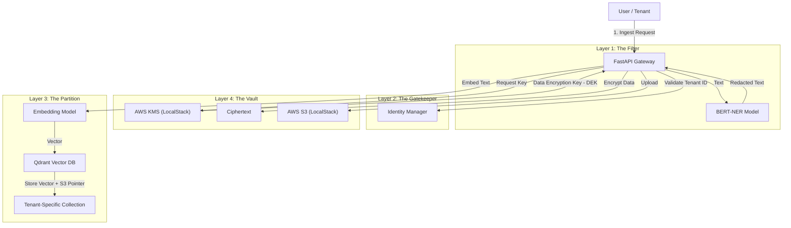

# System Architecture

This document details the **5-Layer Defense Architecture** implemented in the Secure RAG PoC.

## High-Level Data Flow

---

## Detailed Layer Breakdown

### Layer 1: Intelligent Pre-processing (The Filter)
*   **Goal:** Prevent sensitive data from ever entering the permanent storage or vector space.
*   **Mechanism:** We use a **BERT-based Named Entity Recognition (NER)** model.
*   **Workflow:**
    1.  Input text is scanned for entities: `PER` (Person), `ORG` (Organization), `LOC` (Location).
    2.  Detected entities are replaced with placeholders (e.g., `<PER>`, `<ORG>`).
    3.  Only the *scrubbed* text is passed to the embedding model and storage.

### Layer 2: Identity & Access (The Gatekeeper)
*   **Goal:** Ensure requests are strictly scoped to the authenticated tenant.
*   **Mechanism:** API-level enforcement.
*   **Workflow:**
    1.  The API requires a `tenant_id` for every operation.
    2.  In a production scenario, this would be extracted from a signed JWT (JSON Web Token) to prevent spoofing.
    3.  The system refuses to process any request that attempts to cross tenant boundaries (e.g., Tenant A requesting Tenant B's collection).

### Layer 3: Vector Isolation (The Partition)
*   **Goal:** Prevent "bleed-over" of search results between tenants.
*   **Mechanism:** **Qdrant Collections**.
*   **Workflow:**
    1.  Instead of one giant index with a `tenant_id` metadata field, we create a **separate Collection** for each tenant (e.g., `tenant_A`, `tenant_B`).
    2.  This ensures that a search query for Tenant A *physically* cannot scan Tenant B's vectors.
    3.  It improves search performance (smaller indexes) and security.

### Layer 4: Cloud-Native Encryption (The Vault)
*   **Goal:** Cryptographic isolation. Even if the database is compromised, the data is unreadable.
*   **Mechanism:** **Envelope Encryption** using AWS KMS and S3.
*   **Workflow:**
    1.  **Master Key (CMK):** Each tenant gets a unique Customer Master Key in AWS KMS.
    2.  **Data Key (DEK):** For every document, we generate a unique Data Encryption Key.
    3.  **Encryption:** The document is encrypted with the DEK.
    4.  **Key Storage:** The DEK itself is encrypted by the Tenant's CMK and stored alongside the vector in Qdrant.
    5.  **Retrieval:** To read the document, the system must ask KMS to decrypt the DEK using the Tenant's CMK. If the tenant is disabled or the key is revoked, the data is instantly inaccessible.

### Layer 5: Runtime Anomaly Detection (The Watchdog)
*   **Goal:** Detect malicious behavior that bypasses static rules (e.g., scraping).
*   **Mechanism:** **Isolation Forest** (Unsupervised Machine Learning).
*   **Workflow:**
    1.  The system logs the semantic embeddings of every query.
    2.  The model learns the "normal" distribution of queries for each tenant.
    3.  **Attack Detection:** If a query falls far outside the normal cluster (e.g., SQL injection patterns, random noise, or drastic topic shifts), it is flagged as an anomaly.
